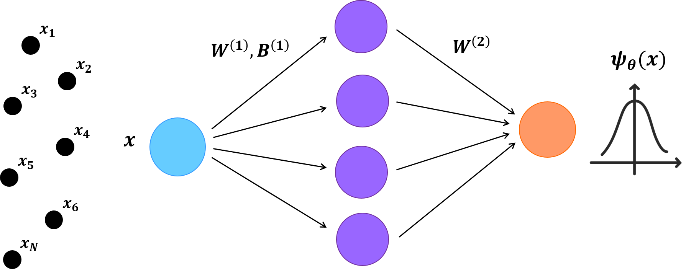

# Function fitting with neural networks
<p align="center"></p>

## What is this repository?
The repository is meant to serve as a tutorial for a first, simple project in PyTorch. The goal is to have a neural network learn a target function. 

Repository structure:

```bash
.
├── assets/                                   # Images, logos
├── .gitignore
├── main.ipynb                                # code file
├── CITATION.cff                              # Citation file
├── LICENSE                                   # License
├── README.md
├── env.yml                                   # Conda environment
└── requirements.txt                          # requirements
```

## Installation
To install this project in your computer, choose one of the following options:

### Option 1. conda            
1. Clone the repository:

`git clone https://github.com/javier-rozalen/ml-tools-for-qm.git && cd ml-tools-for-qm`

2. If ```conda``` is not installed in your system, you can download it from https://docs.conda.io/en/latest/miniconda.html. 
3. Create a conda environment from the ```.yml``` file in the repository: 

`conda env create -f env.yml`

4. Activate the environment: 

`conda activate ml-function-fitting`

5. Install further requirements:

`pip install -r requirements.txt`

### Option 2. Docker   
Coming soon...

## Usage
There are three code files: 
* 1_harmonic_oscillator.ipynb
* 2_double_well.ipynb
* 3_hydrogen_atom.ipynb

They are all in the `.ipynb` format, designed to be open with Jupyter Notebook. To open each of them, run the command `jupyter notebook file.ipynb`, "file" being one of the three scripts in the list above. Each cell cell has been pre-run, so you should be able to see the outputs from the start, even before running the cells. Below is a demo of the first file being run:

<p align="center"></p>

## Uninstall
To remove the virtual environment created with Option 1 follow the steps below:

1. Make sure your current environment is not `ml-tools-for-qm`, or if it is, type:

`conda deactivate`

2. Remove the environment.

`conda remove -n ml-tools-for-qm --all`

3. Remove the local repository.

Windows: `rmdir /S ml-tools-for-qm`

Linux/MacOS: `rm -r ml-tools-for-qm`

## Support
If you have any questions or issues, please contact us at jrozalen@ub.edu.

